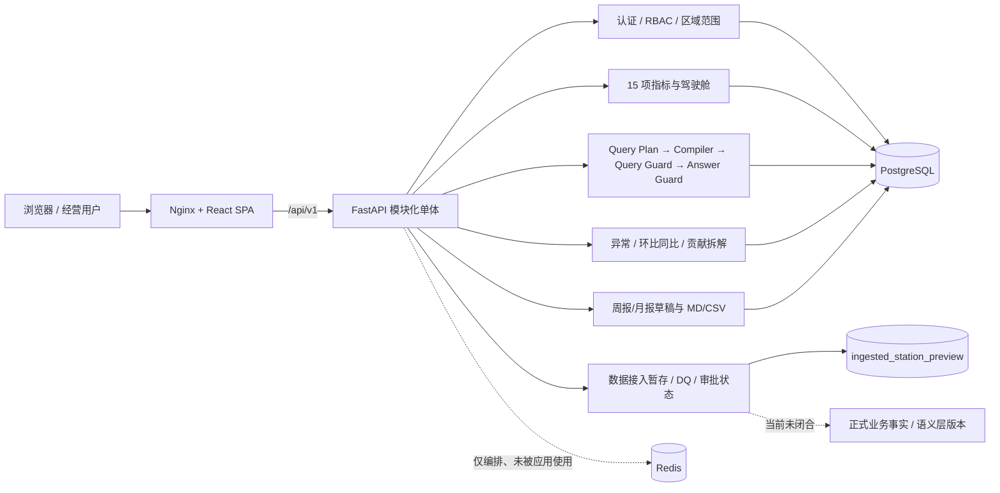

# 项目当前状态与二次开发接手报告

> 审计日期：2026-07-29  
> 审计目录：`E:\新能源企业经营分析智能平台`  
> 审计对象：最终提交 `d6dcb230e33b5bd9e2986070b4c53640d42c9b9c`；审计期间并发开发完成该提交，最终工作区干净  
> 数据边界：固定种子模拟数据；不代表真实企业数据、生产部署或真实经营收益  
> 审计方式：只读代码/配置检查、当前容器 HTTP 核验、前端构建与依赖审计、只读数据质量检查、隔离临时 Schema 迁移循环、无截图写回的页面巡检  
> 项目仓库修改：本次审计未修改仓库代码、配置或业务数据

# 1. 执行摘要

本项目是面向新能源充电运营的 AI 增强经营分析平台，不是通用聊天机器人、自由 SQL 工具或多 Agent 执行系统。核心 Alpha 链路已经真实存在并可在本地 Docker Compose、PostgreSQL 及固定种子模拟数据上运行：认证/RBAC、15 项指标、经营驾驶舱、受控 ChatBI、Query Plan、确定性参数化 SQL、Query Guard、Answer Guard、结构化会话状态、诊断拆解、报告草稿和证据链均有代码、测试和当前运行证据。

当前真实阶段不是“生产可用版本”，而是：

- 已验证的产品级 Alpha 核心；
- V2 P0.1—P0.4 的多数页面和组合视图已实现，但提交和验收未严格按冻结阶段归并；
- V2 P0.5 数据接入已形成数据库暂存、质量、审批和发布状态流，但尚未闭合到正式语义层/业务事实发布，也未完成 `charging_ops` 场景包；
- V2 P0.6 私有化部署、备份恢复、HTTPS、监控和发布候选尚未完成。

按 V2 P0 冻结验收项估算，整体完成度约 **65%—75%**。其中 Alpha 核心约 **85%—90%**，但企业级可用程度仅约 **35%—45%**。估算依据是已验证完成项占冻结阶段必须项的比例，不以文件数量或页面数量代替完成度。

当前系统能够正常运行。本次验证确认：

- Web `http://127.0.0.1:8080`：HTTP 200；
- API 健康检查：HTTP 200，`data_classification=simulated`；
- OpenAPI：25 条路径；
- PostgreSQL：Alembic `0005`；
- 30 万条模拟充电会话、15 项指标；
- DQ-001—DQ-020：20/20 通过；
- 当前核心 API、ChatBI Guard、报告和诊断可调用；
- 11 个 V2 主页面均可达，巡检无浏览器控制台错误或失败请求；
- 前端 Vitest 3/3、生产构建通过、npm audit 0 漏洞；
- 当前拆分后的后端 JUnit 证据合计 45/45。

但不建议直接宣布 V2-P0.5 完成或进入 P0.6。最严重问题是：

1. 数据接入“发布”只更新暂存数据集状态，没有把批准版本提升到正式业务事实/语义层；页面仍可能在接入 API 失败时静默使用 dashboard 数据和字段 fallback。
2. V2 冻结范围排除了 MySQL/REST API，但当前实现和测试已包含二者；同时 `charging_ops` 场景包、Schema/字段发现和至少两个文件样例尚未完成。
3. 页面存在大量“真数据 + 假流程”混合：预警负责人/状态/时间线、报告历史/订阅/行动日期、组织/用户/通知、部分筛选与按钮为硬编码或仅提示。
4. 生产边界未闭合：默认数据库口令在 `APP_ENV=production` 下仍可被配置校验接受；无 HTTPS、备份恢复、监控告警、生产 Compose、CI/CD。
5. 当前分支最终领先远端 11 个提交，最新 `0005` 数据治理工作包已独立提交但尚未推送；交付与远端备份仍未闭合。

推荐下一步：先推送并封存 `d6dcb230` 事实基线，再完成“P0.5 范围纠偏 + 测试基线修复 + 数据发布闭环和场景包”，之后才能进入 P0.6。

# 2. 项目概况

| 项目 | 当前事实 |
|---|---|
| 项目目标 | 为充电运营经营负责人、区域运营经理、数据分析师/管理员提供统一指标、经营驾驶舱、可信问数、异常诊断和报告草稿 |
| 核心业务问题 | 指标口径不一、经营变化难定位、自然语言问数不可控、权限/证据不足、报告结果不可追溯 |
| 用户角色 | `executive`、`regional_manager`、`analyst_admin` |
| 系统形态 | 模块化单体；FastAPI API + React SPA + PostgreSQL + Redis + Nginx |
| 后端 | Python 3.11、FastAPI、SQLAlchemy、Alembic、Pydantic、sqlglot |
| 前端 | React 19、TypeScript 5.8、Vite 6、Vitest、Playwright |
| 数据库 | PostgreSQL 16.9；测试使用 SQLite；Alembic `0001`—`0005` |
| 容器 | PostgreSQL、Redis、API、Web 四服务 Docker Compose |
| AI 边界 | 中文确定性规则解析，不是开放域 LLM；无 RAG、无长期偏好记忆、无多 Agent |
| 当前分支 | `feature/v2-productization` |
| Git 状态 | HEAD `d6dcb230`；相对 `origin/feature/v2-productization` ahead 11；最终工作区干净 |
| 启动 | `一键启动.bat` 或 `docker compose up -d --build` |
| 测试 | pytest、Vitest、Playwright、固定 ChatBI 评测、DQ、Docker 烟测、迁移循环 |
| 部署 | 单机开发型 Compose；不是生产级私有化发布候选 |

文档与代码存在两项直接冲突：

- `README.md` 声明开发账号 `admin / AlphaAdmin!2026`，但 `backend/app/bootstrap.py` 实际创建的是 `analyst / AlphaAnalyst!2026`；运行验证 `admin` 登录返回 401。
- README/架构文档声称生产会拒绝默认数据库口令，但 `Settings.fail_closed_in_production` 只检查 PostgreSQL URL 类型，不检查 `alpha-local-only`；运行时构造生产配置验证可被接受。

# 3. 系统架构



核心可信问数链路真实存在：

```text
自然语言问题
→ 确定性中文解析
→ 版本化 Query Plan
→ 授权场站范围交集
→ 确定性参数化 SQL
→ sqlglot Query Guard
→ SQLAlchemy 只执行服务
→ 结构化结果
→ Answer Guard
→ answer / chart / evidence / analysis_run
```

边界说明：

- “只读执行”目前主要靠编译器、Guard 和固定 API 输入实现；应用数据库账号本身仍是可写账号，不是独立最小权限只读角色。
- Redis 有容器、配置和依赖，但业务代码未使用 Redis；工作状态是单进程内存字典，会话状态在 PostgreSQL。
- 数据接入的已发布状态目前只存在于治理表；主指标仍读取原模拟事实表。

# 4. 项目目录与模块地图

| 路径 | 职责 | 关键入口 | 当前状态 |
|---|---|---|---|
| `backend/app/main.py` | FastAPI 生命周期、中间件、路由 | `app` | 已运行验证 |
| `backend/app/api/` | 25 条 API 路径 | `api_router` | 已运行；部分仅后端使用 |
| `backend/app/services/` | 指标、驾驶舱、诊断、报告、接入 | 各 Service 类 | Alpha 核心完成；接入部分完成 |
| `backend/app/chatbi/` | Plan、解析、编译、Guard、执行、记忆、答案 | `ChatBIService` | 已实现并验证 |
| `backend/app/models/` | 22 张业务/治理表 ORM | `Base` 模型 | 已实现 |
| `backend/app/data/` | 固定 seed 与 20 条数据质量规则 | `generate_simulated_data`、`validate_published_batch` | 已验证 |
| `backend/alembic/versions/` | `0001`—`0005` 迁移 | Alembic | 迁移循环通过；`0005` 已纳入 `d6dcb230` |
| `backend/tests/` | 后端单元/契约/集成/安全测试 | pytest | 当前拆分证据 45/45 |
| `frontend/src/overview.tsx` | V2 产品 Shell 及多数页面 | `ProductApp` | 可运行，但单文件过大且混有静态流程 |
| `frontend/src/revenue.tsx` | 收入与订单专题 | `RevenuePage` | 真 API + 前端计算 |
| `frontend/src/metrics.tsx` | 指标目录/场景预览 | `MetricsPage` | 只读目录真实；管理按钮为边界提示 |
| `frontend/src/main.tsx` | 实际挂载 + 旧版 App 死代码 | `createRoot(...ProductApp)` | 存在大段未使用旧实现 |
| `frontend/e2e/` | 12 个 Playwright spec | 页面测试 | 新页面 spec 较多；2 个旧 Alpha spec 已漂移 |
| `docs/` | 冻结合同、事实基线、阶段验收和证据 | 多份 Markdown | 体系完整但部分事实已过时 |
| `scripts/` | 固定评测、Docker 烟测、迁移证据 | Python 脚本 | `verify_alembic_schema_cycle.py` 仍硬编码 `0004` |
| `docker-compose.yml` | 四服务编排 | Compose | 本地运行通过，非生产配置 |

# 5. 前端现状

## 页面—功能—接口—状态映射

| 页面 | 主要功能 | 真实接口/数据 | 当前状态 | 主要缺口 |
|---|---|---|---|---|
| 功能总览 | KPI、模块入口、系统状态 | summary/trend | 已完成并验证 | “系统正常/数据连接”等状态有静态文案 |
| 经营工作台 | 环比同比、趋势、收入/毛利贡献、重点问题/场站 | summary/trend/stations/diagnostics | 已完成并验证 | 区域/城市/场站筛选只有“全部”；月粒度按钮无其他粒度 |
| 收入与订单 | 日趋势、驱动拆解、区域/城市排名、热力图、下滑场站 | revenue analysis + summary/stations | 已完成并验证 | “查看分析依据”等按钮未绑定；部分洞察为前端规则文本 |
| 毛利与成本 | 毛利桥接、成本结构、度电成本、低毛利场站、建议 | diagnostics/trend/summary | 部分完成 | 维度/分组筛选不改变查询；“预计节省”按硬编码比例计算，无批准口径 |
| 场站经营 | 矩阵、区域分布、等级、排名、详情 | stations/trend/summary | 已完成并验证 | 分群阈值和综合评分为前端启发式，未进入指标合同 |
| 设备健康 | 状态、Pareto、趋势、维修优先级、详情 | devices/trend/summary | 已完成并验证 | “查看详情”等按钮未绑定；无维修工单闭环（按范围也不应自动执行） |
| 经营预警 | 预警列表、风险筛选、贡献、建议、时间线 | diagnostics/anomalies | 部分完成 | 负责人、状态、时间线、处理记录为前端构造；无持久预警实体 |
| AI 经营分析 | 默认问题、结论、指标、趋势、贡献、证据抽屉 | chat/query + dashboard | 已完成并验证 | 收藏/导出/分享未绑定；页面只显示 `simulated`，缺少强制中文“模拟数据”标签 |
| 经营报告 | 周/月报生成、结构化预览、MD/CSV 下载、模块开关 | reports + dashboard/trend | 部分完成 | 报告历史、订阅、行动负责人/期限为硬编码；分享、历史列表和订阅不可用 |
| 数据接入与字段映射 | 数据源目录、测试、试运行、DQ、提交、审批、发布 | data-integration 7 条接口 | 部分完成 | 映射编辑/字段发现不完整；失败时静默 fallback；发布不进入正式事实层 |
| 指标与场景管理 | 15 项指标目录、搜索、详情、场景预览 | metric-catalog | 已完成但只读 | 新增/导入/版本管理只是边界提示；没有真实审批发布管理页 |

## 前端工程结论

- 实际入口是 `ProductApp`；`main.tsx` 中旧版 `App/Dashboard/ChatPanel/...` 已不再挂载，构成显著死代码和维护风险。
- API 调用以手写 `fetch` 和 `any` 为主，没有 OpenAPI 生成类型、统一请求 DTO 或统一错误状态模型。
- Token 存在 `localStorage`，适合当前本地 Alpha，不适合作为生产安全终态。
- 加载/错误状态在主要页面存在，但空数据、403 和部分请求失败后的页面状态不一致。
- `MappingPage` 在接入 API 失败或为空时退回 `mappingFieldsFallback` 和 `stations.slice(...)`，会使接入能力看起来仍有数据，是真实性高风险。
- Vitest 只有 3 个格式化工具测试，没有 React 组件、状态、错误、权限或交互单测。
- 当前 11 页在 1600×900 下均可达，页面高度 900，无控制台错误和失败请求；这只证明当前成功路径可访问，不等于所有按钮和异常状态可用。

# 6. 后端现状

| 模块 | 路由/服务 | 数据访问 | 状态 | 主要问题 |
|---|---|---|---|---|
| 认证/RBAC | `/auth/*` | `app_user`、`audit_log` | 已完成并验证 | 无限流、锁定、刷新/撤销；README 账号漂移 |
| 驾驶舱 | `/dashboard/*` | 15 指标服务、维度/事实表 | 已完成并验证 | 场站逐站计算产生多次查询；规模扩大后有性能风险 |
| 收入专题 | `/revenue/analysis` | 会话、维度表 | 已完成并验证 | 当前只覆盖冻结模拟数据模型 |
| ChatBI | `/chat/*` | Compiler/Guard/Executor、analysis_run/session_state | 已完成并验证 | 确定性规则覆盖有限；DB 账号非最小权限只读 |
| 诊断 | `/diagnostics/*` | 指标、场站贡献、同群 | 已完成并验证 | 只能表述关联；无真正预警生命周期实体 |
| 报告 | `/reports/*` | 已验证结构化结果 | 已完成并验证 | 只生成即时草稿；无报告版本/历史/订阅持久化 |
| 数据接入 | `/data-integration/*` | 连接目录、暂存、运行、DQ、审批 | 部分完成 | 发布只改状态；无正式目标提升；实现了冻结范围外 MySQL/API |
| 配置/日志 | `core/` | Settings、JSON logging | 部分完成 | 生产默认 DB 口令未 fail-closed；无 tracing/metrics |
| Redis/任务 | Compose + 配置 | 无业务调用 | 仅编排/占位基础设施 | 无缓存、队列、重试、定时任务、死信或幂等调度 |

后端分层总体清楚，但 `bootstrap_demo_users()` 调用 `Base.metadata.create_all()`，会在开发/测试中绕过“迁移是唯一 Schema 权威”的原则，并可能掩盖迁移缺失。pytest 也直接 `drop_all/create_all`，因此迁移正确性必须靠独立 PostgreSQL Schema 测试补充。

# 7. 接口与前后端联调状态

运行 OpenAPI 共 **25 条路径**：

| 模块 | 路径数 | 当前前端使用 | 验证情况 |
|---|---:|---:|---|
| system | 1 | 0 | health 已实测 |
| auth | 3 | 1 | login 实测；`me/admin-check` 后端测试 |
| dashboard | 5 | 5 | summary/stations/devices 实测，trend/catalog 页面调用 |
| revenue | 1 | 1 | pytest 与页面调用 |
| diagnostics | 3 | 2 | decomposition/anomalies 页面调用；peer 无当前 UI |
| chat | 3 | 1 | query 实测；schema/delete session 无当前 V2 UI |
| reports | 2 | 2 | draft 实测，export 有后端测试 |
| data-integration | 7 | 7 | overview 实测；6 条写操作由隔离测试覆盖 |
| 合计 | 25 | 19 | 当前源代码未发现前端请求不存在的路径 |

当前主要联调问题不是“404 路径缺失”，而是：

- DTO 全靠手写字典和 `any`，字段漂移只能运行时发现；
- 6 条后端能力没有当前 V2 UI 入口；
- 多个页面按钮没有对应 API 或持久化模型；
- 数据接入的“发布成功”没有后续正式消费链路；
- 旧 Playwright spec 仍使用旧版登录/导航名称，README 的全量 `npm run e2e` 不能视为当前已证明通过。

# 8. 数据库与数据链路

## 数据库结构

ORM 共 22 张业务/治理表：

- 身份与审计：`app_user`、`audit_log`；
- 维度：`dim_region`、`dim_city`、`dim_station`、`dim_device`、`dim_user`、`dim_date`；
- 事实：`fact_charging_session`、`fact_energy_cost`、`fact_operation_expense`、`fact_device_status_event`；
- 数据/指标/分析：`data_generation_run`、`metric_definition`、`analysis_run`、`session_state`；
- 接入治理：`data_source_connection`、`data_set_definition`、`data_ingestion_run`、`ingested_station_preview`、`data_ingestion_quality_check`、`data_ingestion_review`。

## 核心数据链路

```text
固定 seed
→ 维度/事实表
→ DQ-001—DQ-020
→ MetricService
→ Dashboard / ChatBI / Diagnostics / Reports
→ metadata(batch_id, source, data_time, analysis_run_id)
```

当前接入链路：

```text
平台 PG / Excel / CSV / PG / MySQL / REST
→ 固定映射
→ ingested_station_preview
→ DQI-001—DQI-008
→ submit
→ analyst_admin approve/reject
→ published 状态与 release_version
→ 未实现：提升到正式事实表/指标语义层/场景版本
```

## 当前验证事实

- 业务 Schema revision：`0005`；
- 固定模拟数据：3 区域、6 城市、30 场站、120 设备、10,000 用户、546 日期、300,000 会话；
- 当前 DQ：20/20；
- `0001→0005→base→0005` 在专用临时 Schema 验证成功，临时 Schema 已删除；
- 核心业务会话数在审计前后保持 300,000；
- 本次 API 核验只新增正常审计/analysis_run 记录，没有更改业务事实表。

## 数据风险

- 接入暂存表在质量校验前就覆盖当前预览；虽然不影响核心指标，但管理页面会优先展示未发布暂存数据。
- `publish_ingestion` 只改变治理状态，未形成不可变数据版本、正式目标表或语义层激活记录。
- 同一 `analyst_admin` 可提交、审批和发布，缺少可选的职责分离策略。
- `scripts/verify_alembic_schema_cycle.py` 仍断言 head 为 `0004`，与当前 `0005` 不一致。
- `Base.metadata.create_all()` 可能掩盖迁移遗漏。

# 9. 测试、运行与部署状态

## 本次实际执行

| 检查 | 结果 |
|---|---|
| `git status --short --branch`、Git log、文件扫描 | 完成；审计初期为 ahead 10 + 未提交改动，最终为 `d6dcb230`、ahead 11、工作区干净 |
| `docker compose ps --format json` | db/redis/api healthy；web running、无 healthcheck |
| Web/API/OpenAPI HTTP | Web 200、health 200、25 路径 |
| 核心 API 计时 | summary 162ms、stations 636ms、devices 293ms、diagnostics 1707ms、report 1250ms、ChatBI 1904ms |
| 权限负向 | 区域用户跨区域 ChatBI 403；区域用户接入任务 403 |
| README 账号核验 | `admin` 登录 401，文档与代码冲突 |
| 生产配置负向 | 默认数据库口令可被 production Settings 接受，发现缺口 |
| `npm.cmd test` | 3/3 通过 |
| `npm.cmd run build` | TypeScript + Vite 成功 |
| `npm.cmd audit --audit-level=low` | 0 漏洞 |
| 无写回页面巡检 | 11/11 页面可达；无控制台错误和失败请求 |
| 当前数据库 DQ | 20/20 通过 |
| 隔离 Schema 迁移 | upgrade/downgrade/re-upgrade 全通过；临时 Schema 已删除 |

## 审计期间读取到的当前后端 JUnit 证据

这些测试由同一工作区的并发开发进程生成，本次审计只读取结果，没有重复争用同一 SQLite 测试库：

- `docs/v2/evidence/p0_5/phase-next-auth.xml`：6/6；
- `docs/v2/evidence/p0_5/phase-next-query-security.xml`：15/15，其中危险 SQL 12/12 拒绝；
- `docs/v2/evidence/p0_5/phase-next-backend-regression.xml`：16/16；
- `docs/v2/evidence/p0_5/phase-next-data-integration.xml`：8/8；
- 合计：45/45，0 failures、0 errors、0 skipped。

## 未验证或不能判定为通过

- 没有运行仓库的全量 `npm.cmd run e2e`：现有 spec 会写回跟踪中的截图/manifest，且 `alpha.spec.ts`、`v2_p0_0_evidence.spec.ts` 仍引用旧版页面名称；当前全量 E2E 不能标记为已通过。
- 没有运行会覆写正式评测输出文件的 `scripts/run_chatbi_eval.py`；历史 40/40 证据存在，但本轮未刷新。
- 没有进行冷环境重新构建和安装、备份恢复、HTTPS、生产配置、故障恢复或并发压测。
- 没有真实企业数据或真实外部 PostgreSQL 接入验证。

## 部署结论

当前 Compose 适合本地 Alpha：

- API 启动自动迁移；
- DB/Redis 有持久卷；
- Nginx 反代 API；
- PostgreSQL/Redis 不暴露宿主端口。

但不满足 P0.6：

- 无 TLS/HTTPS、生产反向代理配置；
- 无备份和实际恢复演练；
- 无日志采集、指标、告警、trace；
- 无升级前检查、滚动/停机策略、发布清单；
- 无 CI/CD；
- Web 无 healthcheck；
- Compose 固定 `APP_ENV=development` 和自动演示账号。

# 10. 功能完成度矩阵

| 模块 | 前端 | 后端 | 接口 | 数据 | 测试 | 当前状态 | 主要证据 | 主要缺口 |
|---|---:|---:|---:|---:|---:|---|---|---|
| 认证/RBAC | 70% | 90% | 90% | 90% | 90% | 已完成并验证 | auth API、6/6 | 生产认证能力、限流、UI 用户信息 |
| 指标语义层 | 80% | 90% | 90% | 90% | 90% | 已完成并验证 | 15 指标、catalog、DQ | 治理审批 UI、场景包抽离 |
| 经营工作台 | 85% | 85% | 85% | 90% | 65% | 已完成并验证 | 页面/API巡检 | 多级筛选、组件测试 |
| 收入专题 | 85% | 85% | 85% | 90% | 75% | 已完成并验证 | revenue API/pytest | 部分交互按钮 |
| 毛利专题 | 80% | 85% | 85% | 90% | 70% | 部分完成 | diagnostics/页面 | 无依据节省比例、筛选假交互 |
| 场站专题 | 80% | 85% | 85% | 90% | 70% | 部分完成 | stations/页面 | 前端启发式分群/评分未合同化 |
| 设备专题 | 80% | 85% | 85% | 90% | 70% | 部分完成 | devices/页面 | 详情动作、维修闭环 |
| 经营预警 | 70% | 55% | 60% | 55% | 60% | 部分完成 | diagnostics/anomalies | 无预警实体；状态/负责人/时间线为 Mock |
| ChatBI | 85% | 90% | 90% | 90% | 90% | 已完成并验证 | Guard、15 安全测试、运行 API | 规则覆盖有限；中文真实性标签缺失 |
| 报告 | 75% | 85% | 85% | 85% | 75% | 部分完成 | draft/export | 历史、订阅、行动计划为静态；无版本实体 |
| 数据接入 | 65% | 65% | 75% | 55% | 80% | 部分完成 | 7 路径、8/8 | 发布不入正式层、范围越界、fallback |
| 会话记忆 | 无独立管理页 | 85% | 80% | 85% | 90% | 已完成并验证 | session_state/memory tests | 单进程工作状态、无清理调度 |
| 部署运维 | 30% | 40% | 30% | 40% | 35% | 部分完成 | 本地 Compose | P0.6 基本未完成 |

# 11. 已确认完成项

以下内容有当前代码和运行/测试证据：

- FastAPI + React + PostgreSQL + Nginx 的本地模块化单体；
- 开发环境认证、三角色、区域范围、401/403、审计；
- 固定 seed 模拟数据与 20 条质量规则；
- 15 项指标及数据库计算；
- 驾驶舱、趋势、场站、设备、收入 API；
- Query Plan、确定性 SQL 编译、Query Guard、只读入口、Answer Guard；
- 结构化同会话状态、TTL 字段、隔离和 analysis_run；
- 环比/同比、诊断、贡献拆解和残差对账；
- 周报/月报草稿及 Markdown/CSV 导出；
- `0001`—`0005` 可回滚迁移；
- 数据接入的暂存、8 条质量规则、提交/审批/发布状态和审计；
- 当前 11 个产品页面成功路径可访问。

# 12. 部分完成项

| 能力 | 已完成 | 未完成/缺口 |
|---|---|---|
| V2 产品 Shell | 导航、统一布局、设计和多数状态 | 当前用户/组织/通知、搜索、收起等为静态或无动作 |
| 专题差异化 | 四专题视觉和主要结构化数据 | 多级筛选、下钻、详情、合同化评分未闭合 |
| 经营预警 | 从诊断结果构建风险列表和贡献 | 无预警表、负责人、处理状态、历史和审计闭环 |
| 报告闭环 | 即时草稿、预览和下载 | 无版本化报告、历史、订阅、分享、人工确认状态 |
| 数据接入 | 平台 PG、Excel/CSV、PG/MySQL/API 读取与暂存 | Schema 发现、可编辑映射、两文件样例、正式发布消费、场景包 |
| 指标治理 | 真实 15 项目录 | 新增/变更/审批/版本记录只是只读边界 |
| 生产配置 | 基础 fail-closed | 默认 DB 口令、TLS、备份、监控、生产 Compose 未完成 |

# 13. 未完成与阻塞项

## P0

1. 修复生产配置校验：显式拒绝默认数据库口令、开发自动账号和开发 Compose 组合。
2. 禁止接入失败时使用业务 dashboard 结果伪装接入成功；必须显示阻塞/错误状态。
3. 明确数据集发布语义：批准版本必须不可变，并有正式目标/语义层激活或明确声明仅暂存预览。
4. 修复迁移验证脚本的 `0004` 硬编码，纳入 `0005`。
5. 封存并提交/回滚当前工作树，恢复可回滚的阶段边界。

## P1

1. 完成 `charging_ops` 场景包及 15 指标结果一致性对账。
2. 将 MySQL/REST 移出 P0 主线或更新冻结决策；不能静默越界。
3. 建立预警和报告的持久实体，或从页面删除虚假的历史/负责人/订阅。
4. 移除无依据“预计节省”比例，改为已批准规则或明确情景假设。
5. 统一 OpenAPI DTO 和前端类型，消除大量 `any`。
6. 修复全量 Playwright 套件和旧导航 spec。

## P2

1. 拆分 `overview.tsx` 和删除 `main.tsx` 旧版死代码。
2. 增加组件、错误、空态、403、过期 Token 和交互测试。
3. 优化场站逐站计算和重复查询，补充慢查询基线。
4. 评估 Redis 是否真正需要；若保留，明确用途、失败策略和测试。

## P3

- UI 可访问性、键盘导航、移动端、主题、文案一致性等常规优化。

# 14. Mock、Demo、Fallback 与技术债清单

| 类型 | 位置/表现 | 判定 |
|---|---|---|
| 静态组织/用户 | Header 中“国际/国内新能源集团”“张伟/运营分析师”“12 条通知” | Mock |
| 假搜索/菜单 | 全局搜索、通知、组织、部分详情、分享、收藏、分页按钮无动作 | 占位交互 |
| 预警流程 | 负责人名单、状态、触发/处理时间线由前端构造 | Mock/部分完成 |
| 报告历史 | 8 条历史、订阅、生成时间、行动负责人/日期硬编码 | Mock |
| 毛利建议数字 | 按 4.2%、5.2%、15%、2.9% 计算节省值 | 未批准硬编码业务假设 |
| 场站评分/分群 | 前端平均阈值和综合评分 | Demo 规则，未进入语义合同 |
| 接入 fallback | API 失败时使用固定映射和 dashboard 场站数据 | 高风险 Demo/Fallback |
| 指标管理按钮 | 新建、导入、版本记录仅弹提示 | 边界提示，不是管理功能 |
| 数据源范围 | MySQL/REST 被实现但冻结 P0 明确排除 | 范围技术债 |
| Redis | 依赖、容器、环境变量存在，但应用无调用 | 未使用模块 |
| 旧前端 | `main.tsx` 保留完整旧版 App，但实际只挂载 ProductApp | 死代码 |
| 旧 E2E | Alpha spec 仍引用旧页面名称且写回截图 | 过期测试 |
| 迁移脚本 | 仍把 head 判定为 `0004` | 过期脚本 |
| README | admin 演示账号与实际 bootstrap 不一致 | 过期文档 |

# 15. 风险清单

| 风险 | 严重度 | 影响 | 证据 | 建议 |
|---|---|---|---|---|
| 接入发布不进入正式数据层 | 高 | “发布成功”不改变经营指标来源 | `publish_ingestion` 只更新 review/dataset | 定义不可变版本和正式激活事务 |
| 接入失败静默 fallback | 高 | 用户可能把原 dashboard 数据当成接入结果 | `mappingFieldsFallback`、`stations.slice` | 错误时阻塞并显示明确来源 |
| 生产默认 DB 口令被接受 | 高 | 私有化部署弱配置可启动 | 生产 Settings 运行核验 | 增加默认口令/连接串拒绝测试 |
| P0 范围越界 | 高 | 工期、攻击面、验收范围膨胀 | MySQL/API 已实现，冻结文档排除 | 回退/隔离到 P1/P2 或正式变更 |
| 假流程混入真数据页面 | 高 | 对外演示和验收误判 | 预警/报告/组织硬编码 | 明确 Mock 标签或完成持久闭环 |
| 无依据节省金额 | 高 | 形成错误经营建议 | 毛利建议固定比例 | 删除或转为明确情景参数 |
| 本地提交未推送 | 中高 | 远端无最新 P0.5 工作包备份 | 最终 ahead 11，HEAD `d6dcb230` | 完成代码审查后推送当前分支，禁止 force push |
| 全量 E2E 漂移 | 中高 | README 验证命令可能失败 | 旧页面名称与写回证据 | 重构为无副作用测试与独立证据采集 |
| DB 账号非只读 | 中高 | Guard 被突破时缺少最后防线 | API 与 ChatBI 共用应用连接 | 独立只读角色/事务只读 |
| create_all 掩盖迁移 | 中高 | 漏迁移在测试中不暴露 | bootstrap/conftest | 生产禁止 create_all，测试增加迁移建库 |
| 无 CI/CD | 中 | 回归依赖本机人工执行 | 无 `.github` | 建立最小流水线 |
| 无监控/备份恢复 | 高（生产） | 故障不可发现、数据不可恢复 | P0.6 未实现 | 完成恢复演练与告警 |
| 场站逐站查询 | 中 | 数据规模扩大后延迟放大 | `station_analysis` 循环 compute | 改为分组聚合查询 |
| localStorage Token | 中（生产） | XSS 后 Token 易泄露 | 前端代码 | 结合部署模型改安全会话方案 |

# 16. 当前真实完成度结论

| 维度 | 完成度区间 | 依据 |
|---|---:|---|
| 业务功能完整度 | 70%—80% | Alpha 主链完成；预警、报告历史、接入发布未闭环 |
| 前端完成度 | 75%—85%（展示）/ 55%—65%（交互） | 11 页可达，但多按钮/筛选/流程为静态 |
| 后端完成度 | 80%—90%（Alpha）/ 60%—70%（V2） | 核心服务强，P0.5/P0.6 未完成 |
| 接口联调 | 80%—90% | 19/25 路径被当前 UI 使用，无缺失路径；DTO 边界弱 |
| 数据库与数据链路 | 80%—90%（模拟核心）/ 40%—55%（外部接入） | 核心 DQ 通过；接入只到暂存/状态发布 |
| 测试 | 65%—75% | 后端 45/45；前端仅 3 单测，全量 E2E 漂移 |
| 安全 | 60%—70%（Alpha）/ 35%—45%（生产） | RBAC/Guard 强；默认口令、只读角色、限流等不足 |
| 可观测性 | 20%—30% | JSON 日志，无 metrics/trace/告警 |
| 部署 | 30%—40% | 本地 Compose 可用，P0.6 未完成 |
| 文档 | 60%—70% | 合同完整，但账号、迁移、测试与当前 V2 漂移 |
| 企业级可用程度 | 35%—45% | 仅本地模拟 Alpha，无真实数据和生产运维验证 |

版本性质判定：**产品级 Alpha + V2 产品化开发中版本**，不是 Beta、发布候选或生产可用版本。

存在明显的“表面完成但链路未闭环”：

- 数据接入“发布”未进入正式语义层；
- 预警、报告历史、订阅和处理状态没有后端实体；
- 部分筛选和按钮只改变视觉状态或显示提示；
- 页面证据测试偏重布局和截图，不能证明所有业务动作可用。

# 17. 二次开发建议

## 阶段 0：封存并同步当前事实基线

- 目标：把已提交的 `d6dcb230` 变成远端可恢复、可复现的真实基线。
- 任务：复核并推送 `d6dcb230`；更新迁移脚本和 OpenAPI 证据；标注 Mock。
- 前置：不得覆盖现有用户改动。
- 验收：工作区干净；当前 45 个后端测试、前端 build、核心页面巡检可复现；文档账号和迁移版本一致。
- 风险：误把未完成接入发布当作 P0.5 完成。

## 阶段 1：P0 修复与范围纠偏

- 目标：消除真实性、安全和范围阻塞。
- 任务：移除接入 fallback；修复生产口令校验；MySQL/API 移出 P0；删除无依据建议金额；修复旧 E2E。
- 验收：故障/403/空态明确；production 弱配置拒绝；全量测试无副作用且通过。

## 阶段 2：数据接入与场景包闭环

- 目标：完成冻结的 V2-P0.5。
- 任务：CSV/Excel/PG Connector 契约、字段发现、映射版本、质量门、不可变发布、正式消费、`charging_ops` 包、15 指标对账。
- 前置：数据合同和发布语义冻结。
- 验收：两个文件样例和一个本地 PG 样例；发布前后指标结果可追踪；失败批次不影响正式数据。
- 风险：真实数据/凭据不得进入仓库。

## 阶段 3：测试与稳定性

- 目标：让“功能完成”可被自动证明。
- 任务：组件测试、API DTO、错误/空态/403、旧 E2E 清理、性能基线、只读 DB 角色、并发与幂等。
- 验收：后端、前端、E2E、安全、DQ、迁移、固定评测统一通过；证据采集与功能测试分离。

## 阶段 4：体验与性能

- 目标：清理真/假流程混合和查询瓶颈。
- 任务：预警/报告实体化或收缩页面；多级筛选；聚合查询；删除死代码；可访问性。
- 验收：所有可见操作要么真实完成，要么明确禁用/标注规划；关键 API 延迟和查询次数有基线。

## 阶段 5：私有化部署发布候选

- 目标：完成 V2-P0.6，而不是宣称生产上线。
- 任务：生产 Compose、HTTPS、密钥、备份恢复、日志/指标/告警、升级回滚、安装指南、冷环境验收。
- 验收：全新环境安装、备份实际恢复、升级/回滚演练、弱配置 fail-closed、完整 RC 证据。
- 风险：本地验证不得升级表述为企业生产验证。

# 18. 下一步最优执行清单

| 编号 | 优先级 | 任务 | 涉及模块 | 前置条件 | 验收标准 |
|---:|---|---|---|---|---|
| 1 | P0 | 复核并推送 `d6dcb230` P0.5 工作包 | Git、Alembic、接入 | 当前工作区干净 | 远端包含提交、无 force push、可 revert |
| 2 | P0 | 修复迁移循环脚本 `0004` 硬编码 | scripts/Alembic | `0005` 提交确定 | 空 Schema 到 head、回退、再升级自动通过 |
| 3 | P0 | 修复 README 演示账号和当前测试数量 | README/bootstrap | 无 | 文档账号可登录，命令与当前代码一致 |
| 4 | P0 | 强化 production fail-closed | config/compose/tests | 生产参数清单 | 默认 DB 口令、自动账号、开发密钥全部拒绝 |
| 5 | P0 | 删除数据接入静默 fallback | MappingPage/API 状态 | 错误模型冻结 | API 失败时只显示错误/阻塞，不展示替代数据 |
| 6 | P0 | 冻结接入发布语义 | integration/schema/ADR | 产品负责人确认 | 明确暂存、批准、正式激活、回滚和消费边界 |
| 7 | P1 | 将 MySQL/REST 移出 P0 主线 | Connector/文档 | 范围裁决 | P0 只保留 CSV/Excel/PG；测试分组明确 |
| 8 | P1 | 实现 `charging_ops` 场景包 | metrics/parser/reports/data | 发布语义冻结 | 15 指标迁入后结果完全对账 |
| 9 | P1 | 修复全量 Playwright | frontend/e2e | 页面名称冻结 | 测试不写跟踪证据；当前 11 页成功/错误路径通过 |
| 10 | P1 | 清理假业务数字和假流程 | margin/alerts/reports/header | 业务规则确认 | 无未标注硬编码经营金额、负责人或历史 |
| 11 | P1 | 建立 OpenAPI 类型生成和 DTO 契约 | backend/frontend | API 版本冻结 | CI 检测字段漂移，移除关键链路 `any` |
| 12 | P2 | 优化场站分组查询 | Metric/Dashboard | 性能基线 | 查询次数与 P95 达标，结果与现有指标对账 |
| 13 | P2 | 增加生产只读执行角色 | DB/ChatBI/部署 | 权限矩阵 | ChatBI 连接无法写表，Guard 测试继续 100% |
| 14 | P2 | 完成 P0.6 私有化 RC | deploy/docs/monitoring | P0.5 PASS | 冷启动、备份恢复、HTTPS、监控、升级回滚通过 |

# 19. 证据索引

## 项目与冻结事实

- `README.md`
- `AGENTS.md`
- `docs/00_PROJECT_FACT_BASELINE.md`
- `docs/decision_log.md`
- `docs/metric_dictionary_v0.1.md`
- `docs/query_plan_contract_v0.1.md`
- `docs/rbac_and_sql_security_contract_v0.1.md`
- `docs/v2/V2_productization_execution_baseline_v1.1.md`
- `docs/v2/V2_P0_scope_and_acceptance.md`
- `docs/v2/V2_backlog.md`

## 后端入口与核心类/函数

- `backend/app/main.py`：`app`、lifespan
- `backend/app/api/router.py`：`api_router`
- `backend/app/api/dependencies.py`：`current_user`、`require_roles`
- `backend/app/services/metrics.py`：`MetricService`
- `backend/app/services/dashboard.py`：`DashboardService`
- `backend/app/chatbi/parser.py`：`parse_question`、`parse_with_context`
- `backend/app/chatbi/compiler.py`：`compile_query`
- `backend/app/chatbi/guard.py`：`guard_compiled_query`、`reject_arbitrary_sql`
- `backend/app/chatbi/executor.py`：`execute_readonly`
- `backend/app/chatbi/service.py`：`ChatBIService`
- `backend/app/chatbi/memory.py`：`WorkingMemoryStore`、`SessionMemory`
- `backend/app/services/diagnostics.py`：`DiagnosticService`
- `backend/app/services/reports.py`：`ReportService`
- `backend/app/services/data_integration.py`：`DataIntegrationService`

## 前端入口与页面

- `frontend/src/main.tsx`：实际挂载 `ProductApp`，同时包含旧版死代码
- `frontend/src/overview.tsx`：Shell、工作台、毛利、场站、设备、预警、ChatBI、报告、接入
- `frontend/src/revenue.tsx`：收入专题
- `frontend/src/metrics.tsx`：指标目录
- `frontend/e2e/*.spec.ts`：页面 E2E 和证据采集

## 数据库与迁移

- `backend/app/models/auth.py`
- `backend/app/models/business.py`
- `backend/app/models/integration.py`
- `backend/alembic/versions/0001_auth_and_audit.py`
- `backend/alembic/versions/0002_business_schema.py`
- `backend/alembic/versions/0003_memory_and_analysis_run.py`
- `backend/alembic/versions/0004_data_integration.py`
- `backend/alembic/versions/0005_ingestion_quality_release.py`
- `backend/app/data/quality.py`

## 当前测试证据

- `docs/v2/evidence/p0_5/phase-next-auth.xml`：6/6
- `docs/v2/evidence/p0_5/phase-next-query-security.xml`：15/15
- `docs/v2/evidence/p0_5/phase-next-backend-regression.xml`：16/16
- `docs/v2/evidence/p0_5/phase-next-data-integration.xml`：8/8
- `frontend/tests/format.test.ts`：3/3

## 回滚与审计影响

- 本次未修改仓库文件，不需要代码回滚。
- 前端构建只生成被 `.gitignore` 排除的 `frontend/dist` 等构建产物。
- 迁移测试只使用 `audit_20260729_0005_cycle` 临时 Schema，已确认删除。
- 当前业务会话仍为 300,000；本次 API 验证只产生正常的 `audit_log` 和 `analysis_run` 记录，不应为“清理测试”而删除审计记录。
- 若后续回滚现有用户改动，应使用独立提交后的 `git revert` 和对应 `alembic downgrade`，不得使用 `git reset --hard` 或删除数据卷。

## 阶段准入结论

**不允许直接宣称 V2-P0.5 完成，也不建议直接进入 V2-P0.6。**

允许进入的下一工作包是：

**“推送当前事实基线与 P0 修复”**，随后完成 **“V2-P0.5 数据接入和 charging_ops 场景包闭环”**。只有 P0.5 的范围、功能、数据、回归和证据四道门禁全部通过后，才允许进入 P0.6。
